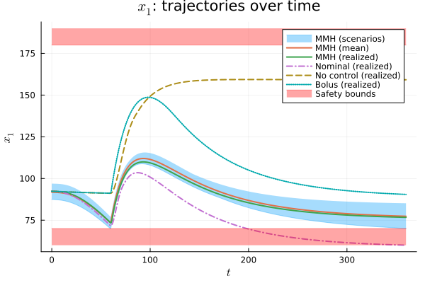

# [Optimal Control](@id optimal-control)

Once a posterior over the system dynamics and latent states has been obtained via the MMH sampler, it can be used to **compute control inputs that explicitly account for model uncertainty**.

This example demonstrates how to formulate and solve a **scenario-based optimal control problem (OCP)** using posterior samples learned from infrequent output measurements.

The full implementation can be found in `experiments/optimal_control.jl`.

## Problem Setting

We consider an optimal control problem in which the system dynamics are uncertain and only partially observed during training.

The objective is to compute a control input \(u(t)\) (e.g., insulin infusion) that

- minimizes a performance cost (e.g., deviation from a reference trajectory),
- respects safety constraints (e.g., bounds on glucose levels),
- remains robust with respect to uncertainty in the learned dynamics.

Rather than optimizing with respect to a single nominal model, the control input is optimized **jointly across multiple scenarios**, where each scenario corresponds to one posterior sample obtained from the MMH sampler.

The result is a single control trajectory that performs well across a representative set of system realizations consistent with the available measurements and prior information.

## Cost Function and Constraints

The OCP is specified through standard Julia functions defining the running cost, terminal cost, and constraints.

```julia
# Running cost:
# Penalize deviation from the reference glucose level and control effort.
c(u, x, t) = W_G * (x[1] - G_REF)^2 + W_U * (u[1] - U_BASAL)^2 

# Terminal cost:
# Encourage convergence to the reference at the end of the horizon.
c_f(x) = W_Gf * (x[1] - G_REF)^2

# State constraints:
# Glucose must remain within safety bounds.
# Constraints are formulated as h(u, x, t) ≤ 0.
h_scenario(u, x, t) = [
    x[1] - G_MAX;   # x[1] ≤ G_MAX
    G_MIN - x[1]    # x[1] ≥ G_MIN
]
```

These definitions are independent of the uncertainty representation and can be adapted to other systems and applications.

## Scenario-based optimal control

Given a set of posterior samples obtained from the MMH sampler, the scenario OCP is solved by discretizing the dynamics and optimizing jointly across all scenarios.

```julia
# Prediction horizon and discretization
H = 6 * 60.0       # 6 hours
N = Int(H / 0.5)   # discretization points

# Solve the scenario-based OCP
U_opt, X_opt, t_grid, J_opt = solve_MMH_OCP(
    MMH_samples,        # posterior samples (scenarios)
    n_u,                # number of control inputs
    f_theta, g_theta,   # dynamics and measurement models
    H, N,               # horizon and grid
    c, c_f,             # costs
    h_scenario,         # state constraints
    h_u                 # input constraints
)
```

Internally, `solve_MMH_OCP` propagates each scenario forward in time and enforces shared control inputs across all scenarios, yielding a control policy that explicitly accounts for uncertainty in the learned model.

## Evaluation and comparison

The optimized control trajectory is evaluated by simulating the true system forward in time.



In `optimal_control.jl`, the proposed uncertainty-aware controller is compared against several baselines:

- **Nominal OCP**, using a point estimate of the dynamics and an EKF state estimate,
- **No control**, serving as a lower-performance baseline,
- **Simple bolus control**, representing a heuristic therapy rule.

The results typically show that the MMH-based controller behaves more conservatively, respecting safety constraints even for unfavorable parameter realizations, and achieves lower overall cost due to improved prediction under uncertainty.

In contrast, nominal controllers may violate constraints as a result of overconfidence in a single model estimate.