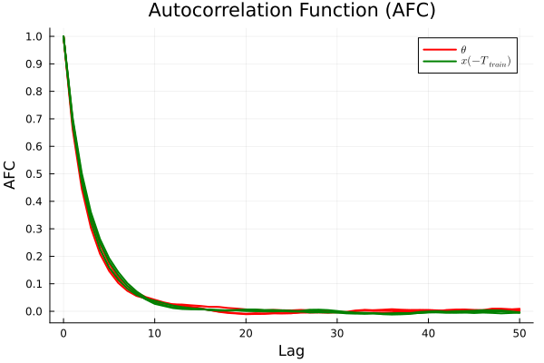

# [Inference and Sampler Tuning](@id sampling)

This example demonstrates how to perform **Bayesian inference with the Marginal Metropolis–Hastings (MMH) sampler** with ODE-integrated latent trajectories, and how to tune the sampler for reliable posterior exploration. Proper tuning is essential for efficient mixing and for obtaining posterior samples that are suitable for downstream planning and control.

The complete, executable script corresponding to this section is available at `experiments/sampler_tuning.jl`.

## Problem Setting

We consider a continuous-time **dynamical system with unknown parameters and latent states, observed through infrequent and noisy output measurements**. In this example, the system is a glucose–insulin model for a patient with type-1 diabetes.

Assumptions in the example:

- The structure of the dynamics is known.
- A subset of model parameters and the initial latent state are unknown.
- Only noisy measurements of the output are available (no full state measurements).
- Measurements are available only at discrete, irregular time instants.

The goal of inference is to obtain samples from the **posterior distribution over unknown parameters and latent state trajectories** that are consistent with the observed input–output data.


## Setup and Data Generation

The script defines the glucose–insulin dynamics and generates synthetic data to mimic a realistic learning scenario. The training set consists of sparse glucose measurements over a 12-hour window; additional measurements are retained as a test set for posterior validation.

The full model definition is available in the script.

## ODE Solver Configuration

The MMH sampler embeds a numerical ODE solver to propagate candidate dynamics between measurement times. Any solver from `DifferentialEquations.jl` can be used.

-   **For control**: the fixed-step solver `RK4()` is recommended for consistency with the optimal control formulation.
-   **For long trajectories or fine resolutions**: variable-step solvers with appropriate tolerances can significantly reduce runtime.

```julia
using DifferentialEquations

rk4_step_size = 0.5 # step size for RK4 solver
ODE_solver = RK4() # ODE solver algorithm
ODE_solver_opts = (dt=rk4_step_size, adaptive=false) # ODE solver options
```

## Prior Specification

Prior selection is a critical part of tuning: it incorporates domain knowledge and restricts the region of parameter space explored by the sampler.

- Overly broad priors can lead to slow convergence and poor mixing.
- Overly restrictive priors can bias the inference and prevent recovery of plausible models.

In this example:

- Unknown parameters are modeled on a log scale to enforce positivity.
- Log-normal priors are chosen such that most probability mass lies within physically plausible ranges reported in the literature.

```julia
const theta_mean = [
    -4.26,      # log(p2)
    -13.27,     # log(p3)
    -1.66       # log(n)
]

const theta_var = [
    0.18^2,
    0.28^2,
    0.23^2
]
```

A Gaussian prior is also assumed for the initial latent state, centered near a basal equilibrium with moderate variance.

## Running the MMH Sampler

We employ a **staged MMH strategy**, which incrementally increases the amount of data used during sampling. This helps the sampler locate high-probability regions of the posterior before long runs are used for uncertainty quantification.

### Key tuning parameters

**Staged refinement:**
-   `M_chunk`: number of measurements added per stage
-   `K_stage`: number of samples drawn per stage
-   `alpha`: proposal covariance scaling (target acceptance rate ≈ 25%)

**Final sampling:**
-   `K`: total number of samples
-   `k_d`: thinning factor (used to reduce autocorrelation)

```julia
MMH_samples, acceptance_ratio, runtime = staged_ODE_MMH(
    # data, model, and prior definitions
)
```

### Practical tuning guidance:

- If the acceptance ratio is far from ≈25%, adjust `alpha` (increase it if acceptance is too high; decrease it if acceptance is too low).
- If chains mix poorly (high autocorrelation, sticky traces), increase `K_stage` and/or reduce `M_chunk`.

## Diagnostics and Sampler Assessment

After sampling, it is essential to verify that the chain has mixed well and provides reliable posterior samples.

### Trace Plots

Trace plots should appear approximately stationary after burn-in, without long-term trends, and should show reasonable jump sizes. Persistent drift or long plateaus typically indicate insufficient mixing or overly aggressive proposals.

### Autocorrelation and ESS

The autocorrelation function (ACF) reveals the dependence between consecutive samples, while the effective sample size (ESS) summarizes how many effectively independent samples are available.

```julia
autocorrelation = compute_autocorrelation(MMH_samples; max_lag=50)
ess = compute_ess(MMH_samples; max_lag=100)
```



A well-mixed chain exhibits rapidly decaying autocorrelation across all parameters and latent states.
If autocorrelation remains high at large lags, this indicates poor mixing and suggests adjusting the proposal scaling (`alpha`), increasing the number of samples per stage (`K_stage`), or reducing the amount of data added per stage (`M_chunk`).

A key tuning objective is to maximize ESS per unit time, while obtaining approximately independent samples.

### Posterior Validation

Posterior samples are validated by simulating the system forward and comparing predictions to held-out test data.


The posterior mean should track the test trajectory reasonably well, while the prediction band reflects uncertainty arising from sparse and noisy measurements.

Qualitative indicators of a well-calibrated posterior include:

- good agreement between posterior mean and test data,
- uncertainty bands that neither collapse prematurely nor grow excessively wide.


If these conditions are not met, revisit prior specification and sampler tuning before proceeding to optimal control.

If they are satisfied, the inferred posterior models are suitable for downstream control tasks.